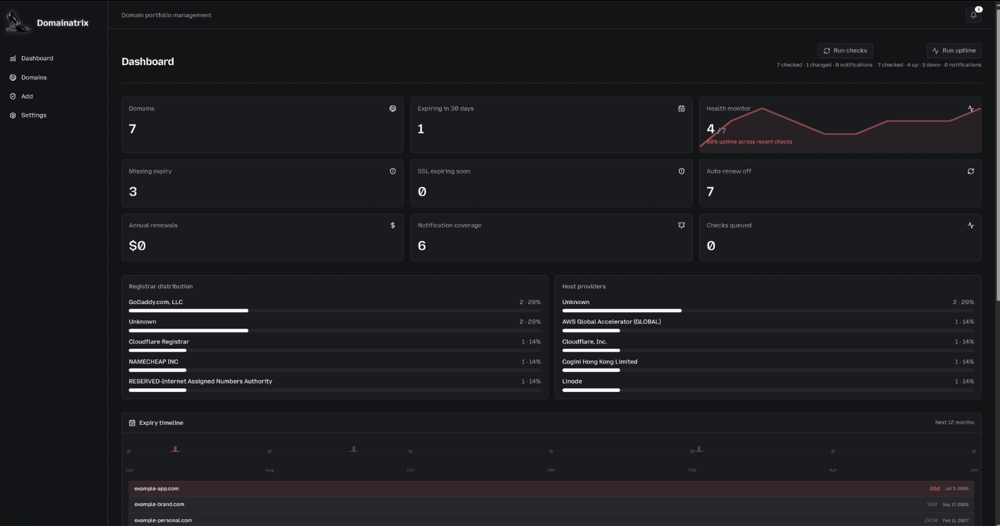
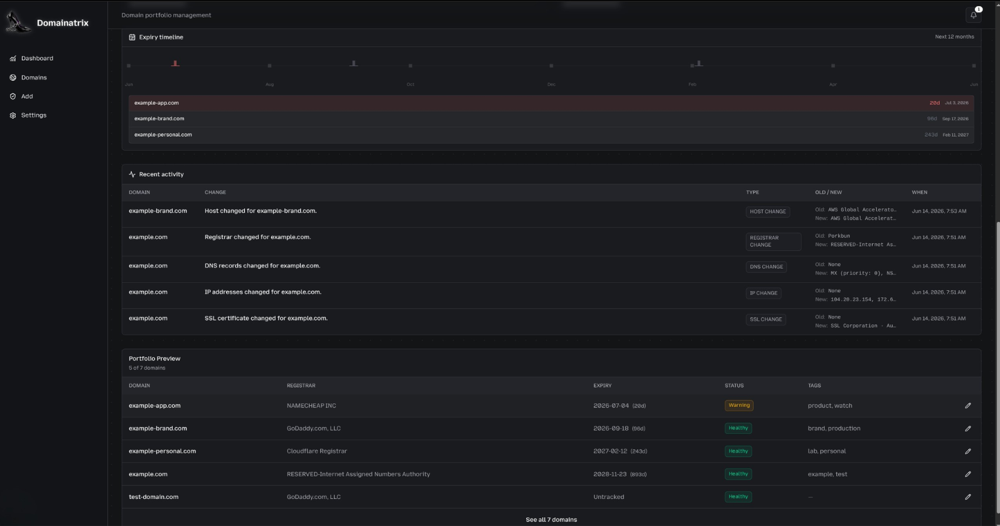
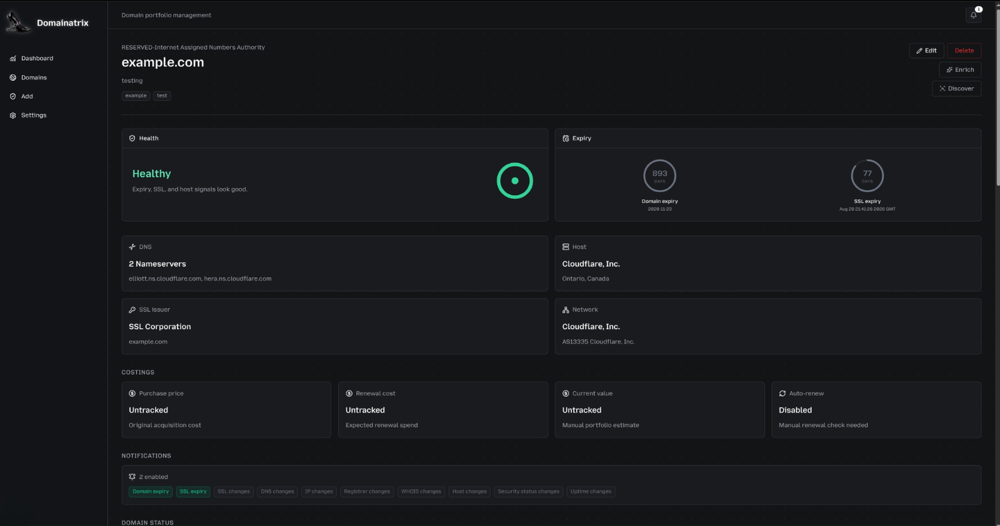

# Domainatrix

<p align="center">
  
</p>

Domainatrix is a self-hostable domain portfolio manager, diagnostic tracker, and uptime monitor. Build a clean overview of your entire domain portfolio, track WHOIS changes, diagnose DNS records, check SSL certificate health, discover hidden subdomains, and monitor real-time HTTP uptime from a single desktop or server console.

Designed specifically for developers, designers, and domain collectors who want full privacy and control without paying for complex external platforms.

---

## Key Features

* **Rich Visual Dashboard**: Monitor overall portfolio health, pending domain and SSL expirations, registrar distribution, host distribution, and notification coverage.
* **12-Month Expiry Timeline**: An interactive SVG visual timeline mapping out domain expirations over the coming year by urgency.
* **One-Click Enrichment**: Fetch live WHOIS, DNS (NS, MX, TXT, IPv4, IPv6), SSL certificate details, and host geolocation (ISP, Org, City, Country) in a single click.
* **Uptime Monitoring**: Run lightweight HTTP uptime checks, monitor response latency, and review a dense, GitHub-style uptime history grid.
* **Subdomain Discovery**: Scan and locate active subdomains automatically using crt.sh Certificate Transparency logs and custom DNS wordlist HTTP probing.
* **Notification Preferences**: Configure granular per-domain alerts. Receive updates on expirations, SSL changes, IP shifts, registrar alterations, or downtimes.
* **Multiple Notification Channels**: Deliver automated JSON payloads to Discord/Slack webhooks or SMTP emails.
* **Chrome UX Report (CrUX)**: Opt-in performance panel displaying real-world Core Web Vitals (LCP, CLS, INP) gauges for monitored domains.
* **CSV & JSON Portability**: Back up or restore your portfolio via nested JSON exports or flat CSV lists.

---

## Preview

<p align="center">
  
</p>

<p align="center">
  
</p>

<p align="center">
  
</p>

---

## Running Locally (Development)

### 1. Prerequisites
Ensure you have Node.js (v20+) and npm installed on your system.

### 2. Setup
Clone the repository and install the dependencies:

```bash
git clone https://github.com/pinkpixel-dev/domainatrix.git
cd domainatrix
npm install
```

Copy the example environment configuration:

```bash
cp .env.example .env
```

### 3. Generate the Database Schema
Initialize migrations and set up your local SQLite database:

```bash
npm run db:generate
npm run db:migrate
```

### 4. Run the Dev Server
Launch the local Next.js web application:

```bash
npm run dev
```

Open your browser to `http://localhost:8765`.

---

## Desktop App (Electron)

Domainatrix runs as a fully integrated desktop client built with Electron.

### Run Desktop Client in Development
To rebuild native SQL wrappers and launch the local Electron shell:

```bash
npm run electron:dev
```

### Compile Desktop Packages
To build production-ready desktop installers for Linux (`.deb`, `.rpm`, `.AppImage`) or Windows (`.exe`):

```bash
# Compile packages for your host platform
npm run electron:build

# Specific platform builds
npm run electron:build:linux
npm run electron:build:win
```

Installers and packages will compile into `dist/electron/`.

---

## Production Self-Hosting

Domainatrix can be run headless as a lightweight Docker container or a native Node service on any Linux VPS.

Refer to the detailed **[Self-Hosting Guide](file:///home/sizzlebop/PINKPIXEL/PROJECTS/CURRENT/domainatrix/docs/self-hosting.md)** for:
* Docker Compose installation
* Background cron configurations for automated uptime and WHOIS checks
* PM2 / Systemd process management on a Linux VPS

---

## License

Domainatrix is licensed under the Apache 2.0 License. See the [LICENSE](file:///home/sizzlebop/PINKPIXEL/PROJECTS/CURRENT/domainatrix/LICENSE) file for more information.

*Made with 💖 by Pink Pixel.*
